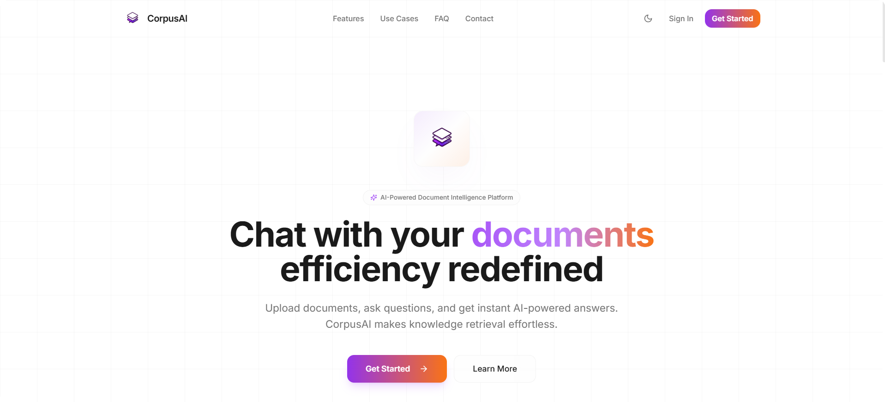
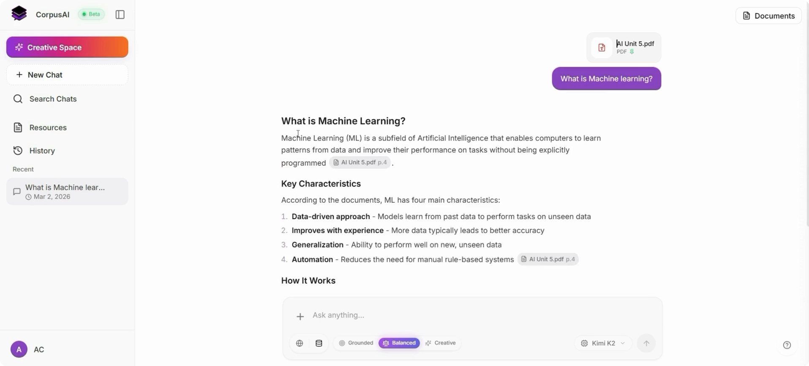

<div align="center">

# 📊 CorpusAI Frontend

**React · Vite · Tailwind CSS**

[](https://react.dev/)
[](https://vitejs.dev/)
[](https://www.typescriptlang.org/)
[](https://tailwindcss.com/)
[](https://appwrite.io/)

<br />

🎥 [Demo 1](https://youtu.be/Nquag0QaE1I) · 🎥 [Demo 2](https://youtu.be/XfuICVTkITg) · 📝 [Kaggle Writeup](https://www.kaggle.com/writeups/ameyac11/corpusai) · 🔗 [DOI](https://doi.org/10.34740/kaggle/w/86626)

<br />

### 📸 Preview

<table align="center">
  <tr>
    <td align="center" width="50%">
      <a href="https://youtu.be/XfuICVTkITg">
        
      </a>
      <br />
      <sub><b>🏠 Landing Page</b> · <a href="https://youtu.be/Nquag0QaE1I">Watch Demo</a></sub>
    </td>
    <td align="center" width="50%">
      <a href="https://youtu.be/XfuICVTkITg">
        
      </a>
      <br />
      <sub><b>💬 Chat Interface</b> · <a href="https://youtu.be/XfuICVTkITg">Watch Demo</a></sub>
    </td>
  </tr>
</table>

</div>

<br />

The client app for **CorpusAI** — an AI-powered document intelligence platform. Upload documents, chat with scoped context, manage your library, and generate content in Creative Space.

Powered by the **[CorpusAI Backend](https://github.com/ameyac11/CorpusAI_Backend)** API.

---

## 🔗 Related Repository

| Repo | Description |
|:---|:---|
| **CorpusAI Frontend** *(this repo)* | React client — chat UI, document management, Creative Space |
| **[CorpusAI Backend](https://github.com/ameyac11/CorpusAI_Backend)** | FastAPI API — RAG pipeline, auth, storage, LLM routing |

---

## ✨ Features

- 💬 **Intelligent Chat** — Scoped document conversations with multiple chat modes
- 📄 **Document Management** — Upload · preview · organize · history
- 🎨 **Creative Space** — AI text & image generation
- 🔐 **Authentication** — Login · signup · OAuth · email verification
- 🚀 **Onboarding** — Guided setup for new users
- 📱 **Responsive** — Desktop & mobile ready
- 📖 **Rich Viewing** — PDF & Markdown rendering

---

## 🛠️ Tech Stack

| | |
|:---:|:---|
| ⚛️ | **React 18** · TypeScript · Vite |
| 🎨 | **Tailwind CSS** · Radix UI · Framer Motion |
| 🔄 | **React Query** · React Hook Form · Zod |
| 🗺️ | **React Router** |
| 🔐 | **Appwrite** |
| 📄 | React PDF · React Markdown |

---

## 📋 Prerequisites

- Node.js 18+
- Running **[CorpusAI Backend](https://github.com/ameyac11/CorpusAI_Backend)** instance (local or deployed)
- Appwrite project (for client-side auth)

---

## 🚀 Quick Start

```bash
npm install
```

Create a `.env` file in the project root, then start the dev server:

```bash
npm run dev
```

🌐 App → [`http://localhost:8080`](http://localhost:8080)

Make sure the backend is running at `http://localhost:8000` (or update `VITE_API_BASE_URL` to match your API).

---

## ⚙️ Environment Variables

| Variable | Description |
|:---|:---|
| `VITE_API_BASE_URL` | Backend API URL (e.g. `http://localhost:8000/api/v1`) |
| `VITE_APPWRITE_ENDPOINT` | Appwrite API endpoint |
| `VITE_APPWRITE_PROJECT_ID` | Appwrite project ID |
| `VITE_WEB3FORMS_ACCESS_KEY` | Web3Forms key for contact form (optional) |

Never commit `.env` files or API keys to version control.

---

## 📦 Build

```bash
npm run build      # production build
npm run preview    # preview production build locally
```

---

## 🌟 Support

If you find this project useful or interesting, please consider giving it a ⭐ on GitHub! Your support helps make the project more visible and encourages further development.

---

## 📜 License

[](./LICENSE)

Licensed under the **GNU Affero General Public License v3.0 (AGPL-3.0)**.  
Copyright © 2026 Ameya Sanjay Chopade · See [LICENSE](./LICENSE) for details.

